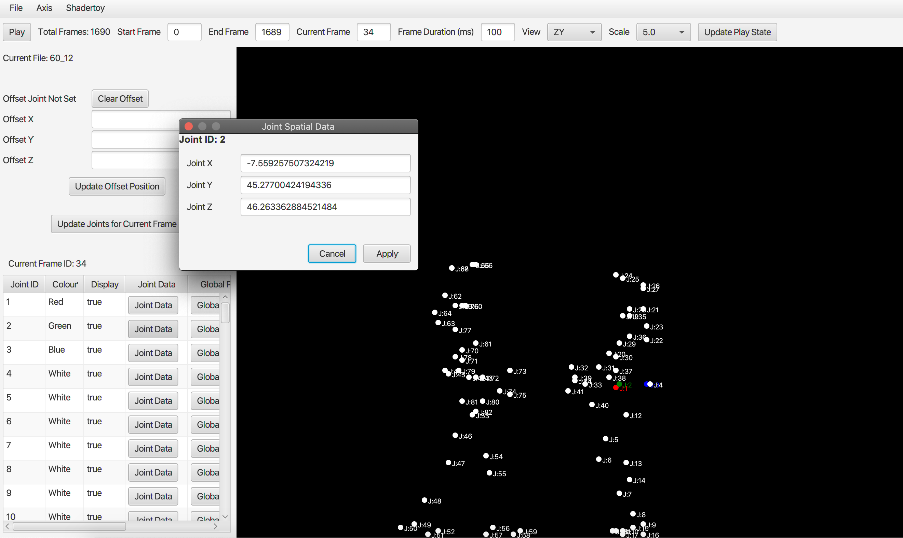

# MoCapParser
A tool for parsing C3D &amp; TRC motion capture files generating compact Fourier transforms of selected data for use in GLSL shaders (specifically Shadertoy). 
Please note that this tool has many quirks (bugs) as I built it for my own amusement to create Shadertoy animations, but hopefully it may be of use to someone. 

This tool is implemented as a command line driven jar and is built with Gradle and Java 11 or greater (JavaFX UI). A pre-built jar can be found in the binary folder.

*./gradlew build*

It has 3 modes of operation:

#### Analyse
*java -jar mocap-parser.jar Analyse filepath*

Use this option to analyse the contents of C3D or TRC files. The output displays metadata information regarding the number of frames, number of joints per frame, camera speed, etc. One useful output is the display of empty joint data in frames. For example:

*00011100*

*00011100*

This output represents 2 frames of data with 8 joints in each frame. Note that the first 3 joints and last 2 joints have no data. This can be used to truncate the number of joints parsed in the Parse operation (see below).

#### Parse
*java -jar mocap-parser.jar Parse filepath optional_start_joint_index optional_end_joint_index*

Use this option to parse C3D and TRC to intermediate .mcd format for use in the Viewer (see below);

#### View
*java -jar mocap-parser.jar View mcd_filepath*

Use this option to play, view and edit .mcd motion capture data. Here is an overview of the features:

###### Playback
Play/Pause - stop or start the animation loop.
Total Frames - total number of frames
Start Frame - start frame for loop
End Frame - end frame for loop
Frame Duration - duration in milliseconds between each animation update
View - flips XYZ orientations of view
Scale - change scale of drawn animation

###### Joints Table
Displays joint data for selected frame.
Joint Data - Open dialogue to view and edit joint spatial data.
Global Parameters - Open dialogue to view and edit the display properties of the joint for every frame.
Set as Center Joint - Sets joint as the center for all joints displayed in the animation window (see Offsets below).

###### Offsets
Offset Joint ID - Displays joint if joint is used as the display offset.
Clear Offset - removes any spatial offsets for display data.
Update Offset Position - Use provided X,Y,Z values to create a spatial offset for the display.

###### Axis Assignment
Re-assign Motion Capture axis to viewer axis. I found that re-assigning to X,Z,Y does the trick.

###### Shadertoy Generate Fourier
Generates a fourier representation of the motion capture data and saves the output to a .shader file (currently suitable for Shadertoy). Reducing the initial Fourier Frames size results in a compression of the data.

###### Open, Save, Save As
Open and Save files in the local running directory.

#### Things to do (apart from general bug fixing):
Create a file format for .mcd files (JSON). Due to laziness the application currently uses object serialisation to save files making them fragile to code changes.

#### Acknowledgments
Motion capture file 60_12.c3d used for testing from http://mocap.cs.cmu.edu

Motion capture file Dog_Run.trc used for testing from https://motioncapturedata.com/animal-motion-capture-dog/

